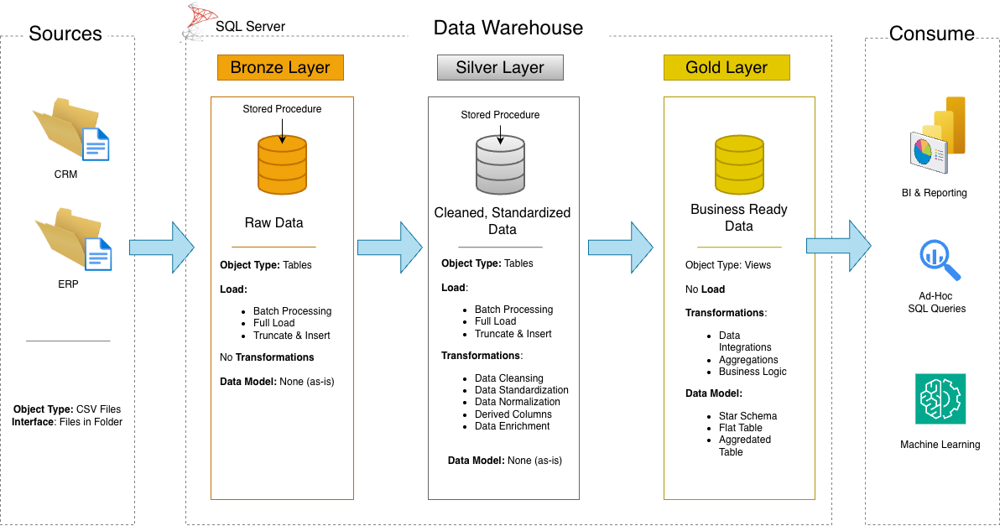

# Sales & Customer Analytics (SQL Data Warehouse Project) 🏢

Building real-world data warehouse with SQL Server that transforms an operational data into clean, analytics-ready insights. The goal is to give a complete makeover to the raw business data!

## 🎯 What's This All About?

I built an end-to-end data warehouse that takes data from CRM and ERP systems, cleans it up, and makes it ready for business intelligence. The project covers sales analytics, customer metrics, and product performance tracking.

### The Cool Part 🌟
Using the **Medallion Architecture** (Bronze → Silver → Gold), the data goes through multiple quality checks and transformations:
- **Bronze**: Raw data, straight from the source
- **Silver**: Cleaned, validated, and standardized 
- **Gold**: Business-ready analytics with star schema design


## 🛠️ Tech Stack & Skills

**Core Technologies:**
- SQL Server & T-SQL
- Star Schema dimensional modeling
- Multi-layered ETL pipelines

**Advanced SQL Techniques:**
- Window Functions (`ROW_NUMBER()`, `LAG()`, `PARTITION BY`)
- CTEs for complex logic
- Date/time functions (`DATETRUNC()`, `DATEDIFF()`)
- Aggregations and joins

**Data Quality Checks:**
- Primary key validation
- Null & duplicate detection
- Data consistency rules (e.g., sales = quantity × price)
- Date range validation
- Standardization checks

## 📊 Analytics Showcase

Built **11 different types of analyses** to answer real business questions:

1. **🔍 Exploratory Analysis** - Understanding the data landscape
2. **📈 KPIs** - Total sales, avg order value, customer metrics
3. **📊 Magnitude Analysis** - Customer distribution, revenue by category
4. **🏆 Ranking** - Top 5 products, best customers, worst performers
5. **📅 Time Trends** - Monthly/yearly patterns and seasonality
6. **💹 Cumulative Metrics** - Running totals and YTD calculations
7. **⚡ Performance Comparison** - This year vs last year, product vs average
8. **🎯 Segmentation** - VIP/Regular/New customers, product cost ranges
9. **🥧 Proportional Analysis** - Category contribution to total sales

### Business Reports 📑

Created two comprehensive analytical views:

**Customer Report** - Everything about customer behavior:
- Demographics & age groups
- Spending patterns & lifetime value
- Customer segments (VIP, Regular, New)
- Recency & purchase frequency

**Product Report** - Deep dive into product performance:
- Revenue segmentation (High/Mid/Low performers)
- Product lifecycle & recency
- Average order revenue
- Monthly revenue trends

## 📁 What's Inside

```
📂 sql_dwh_project/
├── 🎬 init_database.sql              # Database setup
├── ✅ quality_checks_silver.sql      # Data validation
├── 📊 report_customers.sql           # Customer analytics
├── 📊 report_products.sql            # Product analytics
└── 📂 analytics/
    ├── 01-04: Exploration queries
    ├── 05-09: Business analytics
    └── 10-11: Segmentation & proportions
```

## 💡 Why This Matters

This project shows I can:
- Build production-ready data pipelines from scratch
- Write complex SQL with advanced techniques
- Ensure data quality at every step
- Transform business questions into actionable insights
- Design scalable data architectures

**Real-world applications:** Sales forecasting, customer segmentation, product optimization, executive dashboards, customer behavior analysis

## 🚀 The Bottom Line

A complete data warehousing solution demonstrating enterprise-level data engineering skills - from raw data ingestion to business-ready analytics

**Learning Journey:** This project was inspired by the Udemy course "Building a Modern Data Warehouse - Data Engineering Bootcamp" by Baraa Khatib Salkini.

---
*Built with ❤️ and lots of SQL queries*
